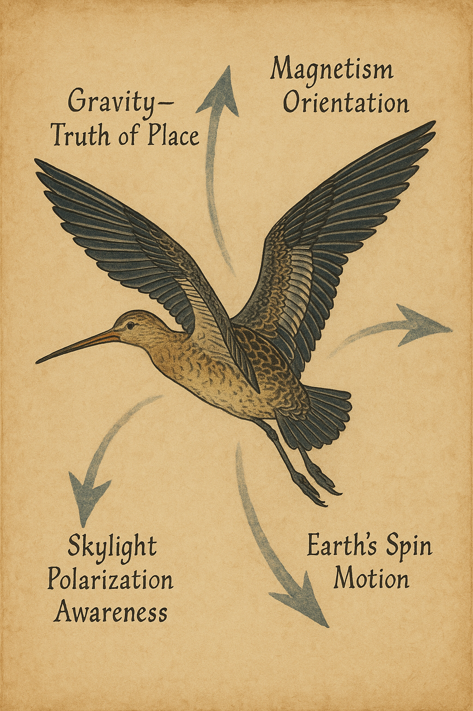

# The Story of Actual Automation: The Actual Playbook (v1.1)

### Language Consistency Note

| Term | Meaning | Use Case |
|------|----------|----------|
| **person** | The locus of automation and provenance — the individual source of truth. | Use in philosophical or architectural contexts. |
| **operator** | A person engaged in work; the active field origin of events. | Use in functional or system design contexts. |
| **witness** | The verifying role of a person or badge; affirms truth. | Use in ethical or attestation contexts. |
| **source** | The point of origin for data or truth lineage within the system. | Use in data architecture or provenance discussions. |
| **machine** | The extension of the person’s capability — a tool placed at the locus of automation to relieve constraint and express truth. | Use when describing automation components or systems derived from the person’s action. |

---

# Language

*defines the vocabulary of Actual — the words that describe how provenance, locus, and conviviality connect technology and person.*

## Card 1 – The locus of automation
**Front**  
**Definition:** *locus* → the point where something originates.  
**Purpose:** Describe where automation truly resides.  
**Insight:** Conventional systems focus *on* people; Actual emanates *from* them.  
**Practice:** Each badge event begins at the person — the locus of provenance — and carries that origin through every connected system.  
**Sketch area:** Person at center, arrows radiating outward.

***

**Back**  
**Source:** Classical Latin *locus*; systems theory and philosophy.  
**Context:** “Locus” refers to origin, not observation.  
**Applied to Actual:** Automation has a moral and operational center: the person. Every record retains its line of origin.

---

## Card 2 – Provenance
**Front**  
**Definition:** *provenance* → the record of origin, custody, and transformation of a thing.  
**Purpose:** Anchor Actual’s integrity in traceable origin.  
**Insight:** Data without provenance is fiction; provenance turns data into evidence.  
**Practice:** Each badge event includes its source: operator, time, intent, and attestation. Provenance stays intact through every integration.  
**Sketch area:** Chain linking person → badge → cloud → system.

***

**Back**  
**Source:** Archival science and authentication disciplines.  
**Context:** Provenance guarantees authenticity by maintaining traceable origin.  
**Applied to Actual:** Actual transforms provenance from archival practice into a live operational principle—each event self-authenticates through its person of origin.

---

## Card 3 – Conviviality
**Front**  
**Definition:** *convivial* → a tool that empowers its user instead of controlling them.  
**Purpose:** Keep automation humane and autonomous.  
**Insight:** Ivan Illich defined convivial tools as those offering maximum control with minimal dependence.  
**Practice:** Actual’s badge and system require no phone, gateway, or local infrastructure; the operator remains a self-contained source of truth.  
**Sketch area:** Tool extending outward from person’s hand.

***

**Back**  
**Source:** Ivan Illich (1926–2002), philosopher and social critic.  
**Context:** *Tools for Conviviality* (1973) warned against industrial tools that alienate users.  
**Applied to Actual:** The badge is Illich’s convivial tool made real—automation that restores autonomy while preserving provenance.

---
# Automation

*explores how automation originates at the person — the locus of provenance — where technology becomes an extension of truth, not a replacement for it.*

## Card 1 – Automation is good as long as you know exactly where to put the machine
**Front**  
**Definition:** *placement* → deliberate choice of where automation belongs.  
**Purpose:** Show that value lies in placement, not quantity.  
**Insight:** Misplaced automation creates friction; placed on the person, it relieves constraint.  
**Practice:** Actual situates the machine at the person through the badge—where truth and friction meet.  
**Sketch area:** Workflow diagram with one node marked “machine placement.”

***

**Back**  
**Source:** Eliyahu M. Goldratt (1947–2011), physicist and creator of the Theory of Constraints.  
**Context:** Goldratt taught that improvement depends on identifying the true limiting factor.  
**Applied to Actual:** The person is both constraint and origin. Automation placed at the locus of work eliminates administrative bottlenecks without removing agency.

---

## Card 2 – The provenance placement
**Front**  
**Definition:** Automation positioned where truth originates.  
**Purpose:** Contrast collection with creation of data.  
**Insight:** Other systems automate observation; Actual automates origin.  
**Practice:** The badge records verifiable evidence at the moment of action, turning each event into trustworthy truth.  
**Sketch area:** Badge connected to timeline labeled “origin → record.”

***

**Back**  
**Source:** Archival provenance + Constructal Law.  
**Context:** Authentic systems preserve their lines of origin.  
**Applied to Actual:** Provenance placement aligns moral geometry with data flow—truth radiates outward from the person.

---

## Card 3 – The badge as witness
**Front**  
**Definition:** *witness* → one who provides verified testimony.  
**Purpose:** Redefine the device as a companion in truth, not surveillance.  
**Insight:** Observation without consent is control; witnessing affirms authorship.  
**Practice:** The badge attests to time, place, and completion automatically, serving as mechanical witness for the operator.  
**Sketch area:** Person and badge linked by a line labeled “witness of work.”

***

**Back**  
**Source:** Legal concept of testimony; adapted through Actual’s design ethic.  
**Context:** A witness validates through presence and accountability.  
**Applied to Actual:** Each badge stands as a mechanical witness—proof with dignity and provenance.

---

## Card 4 – The machine in the person’s loop
**Front**  
**Definition:** *person’s loop* → a feedback cycle in which automation amplifies human judgment.  
**Purpose:** Keep people in command of automated systems.  
**Insight:** Shared autonomy sustains truth; detached autonomy erodes it.  
**Practice:** The badge automates capture but still requires attestation before closure—truth validated by the operator who caused it.  
**Sketch area:** Loop diagram completed by the person node.

***

**Back**  
**Source:** Human-in-the-Loop design from cybernetics and DevOps feedback.  
**Context:** Effective automation requires reciprocal validation between machine and person.  
**Applied to Actual:** Actual refines it as *Person-in-the-Loop of Provenance*—machines operate, persons affirm.

---
# Truth

*examines how truth is preserved through provenance, ensuring that every record, event, and attestation remains anchored to its living source — the person.*

## Card 1 – 395… exactly
**Front**  
**Definition:** *exactness* → precision verified by evidence.  
**Purpose:** Show that trust arises from verifiable precision.  
**Insight:** Approximation breeds doubt; precision builds trust.  
**Practice:** Each badge record is reconciled to the minute, forming a continuous, auditable chain of truth.  
**Sketch area:** Timecard stamped “395 — verified.”

***

**Back**  
**Source:** Eliyahu M. Goldratt and the Plumley story.  
**Context:** Measurement integrity as moral discipline.  
**Applied to Actual:** “395… Exactly” embodies Actual’s culture—truth told precisely, not approximately.

---

## Card 2 – Truthful data
**Front**  
**Definition:** Information retaining unbroken provenance from origin to record.  
**Purpose:** Make truth invariant within automation.  
**Insight:** Data without provenance is fiction; with provenance, it becomes evidence.  
**Practice:** Every event includes operator, time, and attestation context; lineage never breaks.  
**Sketch area:** Ledger entries linked to individual signatures.

***

**Back**  
**Source:** Archival science and digital-forensics principles.  
**Context:** Provenance ensures authenticity and accountability.  
**Applied to Actual:** Live operations obey archival discipline—every data point self-authenticates through its source.

---

## Card 3 – Testimony over tracking
**Front**  
**Definition:** *testimony* → voluntary verification of events.  
**Purpose:** Replace surveillance with attestation.  
**Insight:** Tracking observes people; testimony honors them.  
**Practice:** The badge records presence and completion to confirm work, not monitor behavior.  
**Sketch area:** Person and badge exchanging a handshake labeled “attest.”

***

**Back**  
**Source:** Legal testimony and Illich’s critique of surveillance.  
**Context:** Testimony is active participation; tracking is passive extraction.  
**Applied to Actual:** Data exists to confirm integrity, not to police it—trust through participation.

---

## Card 4 – The immutable record
**Front**  
**Definition:** *immutable* → unalterable once created.  
**Purpose:** Protect truth’s fidelity across time.  
**Insight:** When truth can change, trust collapses.  
**Practice:** Actual stores records as append-only versions; new evidence adds, never overwrites.  
**Sketch area:** Stack of time-stamped records.

***

**Back**  
**Source:** Blockchain and audit-trail design.  
**Context:** Temporal integrity preserves confidence.  
**Applied to Actual:** Immutability at human scale—proof without complexity, permanence without bureaucracy.

---

## Card 5 – The moral geometry of truth
**Front**  
**Definition:** *moral geometry* → structural alignment between truth, provenance, and action.  
**Purpose:** Express truth as both ethical and technical architecture.  
**Insight:** Systems inherit the ethics of their measurements.  
**Practice:** Every Actual flow maintains a straight, visible line from person to outcome—no hidden inference.  
**Sketch area:** Straight line labeled *Origin → Evidence → Outcome.*

***

**Back**  
**Source:** Ethical engineering and Goldratt’s alignment principles.  
**Context:** Geometry represents structural integrity; moral geometry ensures causal integrity.  
**Applied to Actual:** Every line of truth points back to its person of origin, preserving both moral and operational fidelity.

---
# Flow

*explores how flow reveals the geometry of provenance — how truth moves through time and space when automation begins at the person.*

## Card 1 – Flow as provenance in motion
**Front**  
**Definition:** *flow* → the path truth takes as it moves from the person through systems.  
**Purpose:** Redefine flow as the visible movement of provenance.  
**Insight:** True flow begins where truth begins — at the person.  
**Practice:** Actual maps flow through badge events, revealing how time, distance, and sequence converge into work’s living pattern.  
**Sketch area:** Series of connected nodes showing truth traveling outward.

***

**Back**  
**Source:** Constructal Law and system flow theory.  
**Context:** All flow systems evolve to reduce resistance; provenance provides direction.  
**Applied to Actual:** Flow isn’t managed—it’s revealed. Each record of presence and completion draws the natural geometry of the organization.

---

## Card 2 – The rhythm of work
**Front**  
**Definition:** *rhythm* → recurring, observable cadence in the sequence of actions.  
**Purpose:** Describe how Actual exposes and stabilizes operational tempo.  
**Insight:** Rhythm arises when flow is unhindered; delays mark resistance.  
**Practice:** Actual surfaces rhythm through repeatable field events—predictable patterns in presence, movement, and completion.  
**Sketch area:** Waveform of repeating peaks labeled “arrival, work, attest.”

***

**Back**  
**Source:** Time-motion study tradition, Constructal adaptation.  
**Context:** Flow becomes predictable when friction is known.  
**Applied to Actual:** Rhythm measured by operators’ real presence allows planning grounded in truth, not assumption.

---

## Card 3 – The topology of constraint
**Front**  
**Definition:** *topology* → the shape and connection of flow paths.  
**Purpose:** Show that constraint has spatial as well as temporal form.  
**Insight:** Bottlenecks are visible where provenance density is highest.  
**Practice:** Actual visualizes constraints through data clusters—where operators wait, return, or repeat.  
**Sketch area:** Map with narrowing channel indicating constraint.

***

**Back**  
**Source:** Systems topology and Constructal geometry.  
**Context:** Efficient systems minimize unnecessary branching.  
**Applied to Actual:** Constraints appear as shape, not symptom—proof that flow obeys geometry before policy.

---

## Card 4 – The adaptive path
**Front**  
**Definition:** *adaptive flow* → movement that reshapes itself to preserve provenance with minimal resistance.  
**Purpose:** Describe continuous improvement through structural learning.  
**Insight:** Flow must adapt faster than friction evolves.  
**Practice:** Actual compares historical and live data to identify emerging obstructions, updating schedules and patterns automatically.  
**Sketch area:** Two paths—old blocked, new open.

***

**Back**  
**Source:** Constructal Law of design evolution.  
**Context:** Systems survive by adjusting flow pathways.  
**Applied to Actual:** Adaptive flow keeps automation alive—data learns the easiest truthful path.

---

## Card 5 – The still point
**Front**  
**Definition:** *still point* → the moment where flow pauses long enough for truth to settle.  
**Purpose:** Highlight that pause and reflection sustain continuous flow.  
**Insight:** Without stillness, patterns blur; without motion, they decay.  
**Practice:** Actual uses attestation points—end-of-day closures—to synchronize rhythm and renew fidelity.  
**Sketch area:** Circular flow with marked rest node.

***

**Back**  
**Source:** Process theory and Goldratt’s cycle of focus.  
**Context:** Reflection prevents drift from purpose.  
**Applied to Actual:** Each attestation is a still point—the act of re-anchoring flow in truth.

---
# Conviviality

*examines how Actual’s tools preserve agency, dignity, and autonomy — making technology an extension of the person rather than their overseer.*

## Card 1 – Tools that serve
**Front**  
**Definition:** *convivial tool* → one that enhances capability without dependency.  
**Purpose:** Frame design ethics for automation.  
**Insight:** Tools should expand autonomy, not amplify control.  
**Practice:** Actual’s badge frees operators from manual forms and smartphone dependence—automation that gives time back.  
**Sketch area:** Badge handing back a clock to a person.

***

**Back**  
**Source:** Ivan Illich, *Tools for Conviviality* (1973).  
**Context:** Illich argued that industrial tools enslave when they exceed human scale.  
**Applied to Actual:** By design, Actual returns control of time and truth to the person in the field.

---

## Card 2 – Design for clarity
**Front**  
**Definition:** *clarity* → the degree to which a tool’s purpose is self-evident.  
**Purpose:** Reduce cognitive load.  
**Insight:** Confusion is friction; clarity is flow.  
**Practice:** Actual’s interface is environmental—the badge communicates through light, vibration, and timing, not screens or menus.  
**Sketch area:** Minimal icon of a glowing badge.

***

**Back**  
**Source:** Human factors engineering and minimal-interface design.  
**Context:** Tools communicate best when silent.  
**Applied to Actual:** Clarity ensures focus on work, not technology—tools that disappear into use.

---

## Card 3 – Autonomy by architecture
**Front**  
**Definition:** *autonomy* → ability to act independently within shared purpose.  
**Purpose:** Show how Actual preserves freedom inside connected systems.  
**Insight:** True autonomy is architectural, not behavioral.  
**Practice:** Actual’s cellular design allows each badge to operate and report independently, maintaining truth even offline.  
**Sketch area:** Multiple autonomous nodes syncing upward.

***

**Back**  
**Source:** Cybernetic system design and distributed computing.  
**Context:** Resilience arises when units can act without central command.  
**Applied to Actual:** Autonomy built into architecture ensures the network respects individual provenance.

---

## Card 4 – Dignity in data
**Front**  
**Definition:** *dignity* → the respect preserved when people control their own narrative.  
**Purpose:** Prevent surveillance culture in automation.  
**Insight:** Data becomes oppressive when detached from its witness.  
**Practice:** Actual collects only what operators generate through presence and attestation—no monitoring beyond truth.  
**Sketch area:** Shield around a person icon labeled “control of narrative.”

***

**Back**  
**Source:** Ethics of technology and Illich’s moral critique.  
**Context:** Systems that measure without consent degrade trust.  
**Applied to Actual:** Dignity is enforced through design—automation with boundaries.

---
# Design Principles

*defines how Actual learns, scales, and remains truthful — translating provenance into architecture.*

## Card 1 – Design for provenance
**Front**  
**Definition:** *provenance-first design* → building systems around verifiable origin.  
**Purpose:** Make origin a design invariant.  
**Insight:** Architecture inherits the integrity of its first assumption.  
**Practice:** Every module in Actual tracks its source and context; nothing exists without lineage.  
**Sketch area:** System diagram labeled “origin metadata required.”

***

**Back**  
**Source:** Data lineage and quality-engineering principles.  
**Context:** Traceability prevents corruption.  
**Applied to Actual:** Provenance-first design ensures that scale never erodes authenticity.

---

## Card 2 – Architecture of learning
**Front**  
**Definition:** *learning architecture* → a system that improves by observing its own provenance.  
**Purpose:** Describe how Actual evolves.  
**Insight:** Systems that remember their origins can correct without reprogramming.  
**Practice:** Actual compares live patterns against historical truth to suggest operational adjustments.  
**Sketch area:** Feedback loop labeled “truth → insight → refinement.”

***

**Back**  
**Source:** DevOps and adaptive-system theory.  
**Context:** Continuous improvement depends on visible cause and effect.  
**Applied to Actual:** Learning is built into structure—flow informed by past provenance.

---

## Card 3 – Scale without distortion
**Front**  
**Definition:** *scalable truth* → growth that preserves fidelity.  
**Purpose:** Ensure expansion doesn’t dilute integrity.  
**Insight:** Most systems lose accuracy as they grow; provenance preserves it.  
**Practice:** Actual’s distributed edge model scales by replication, not abstraction—each new node remains a source of truth.  
**Sketch area:** Network expanding outward, each node identical.

***

**Back**  
**Source:** Systems engineering and Constructal scaling.  
**Context:** Good design scales shape, not strain.  
**Applied to Actual:** Growth through repetition of truthful units—precision multiplied, not averaged.

---

## Card 4 – Moral engineering
**Front**  
**Definition:** *moral engineering* → designing systems that make the right thing the easy thing.  
**Purpose:** Connect ethics to practicality.  
**Insight:** Every design decision expresses a value; neutrality is fiction.  
**Practice:** Actual encodes transparency, auditability, and provenance so integrity happens by default.  
**Sketch area:** Circuit labeled “integrity = default.”

***

**Back**  
**Source:** Ethical design and Goldratt’s Rules of Flow.  
**Context:** Systems shape behavior more than policy does.  
**Applied to Actual:** By moral design, Actual ensures that honesty requires no extra effort—truth flows naturally.

---

## Card 5 – The principle of simplicity
**Front**  
**Definition:** *simplicity* → the shortest truthful path from origin to outcome.  
**Purpose:** Keep complexity from concealing error.  
**Insight:** Flow decays in proportion to unnecessary detail.  
**Practice:** Actual limits interfaces and dependencies to what preserves provenance; nothing ornamental remains.  
**Sketch area:** Straight line replacing tangled web.

***

**Back**  
**Source:** Reinertsen’s flow economics and Illich’s simplicity ethic.  
**Context:** Simplicity sustains adaptability.  
**Applied to Actual:** The simplest path is the most truthful one—clarity as engineering discipline.

---

# Closing Reflection – The Unbroken Thread

*Everything in Actual begins and ends with provenance — the person as origin, the system as witness, and truth as continuity.*

In most automation, data moves faster than understanding.  
Speed becomes the goal, precision the casualty, and trust a hopeful assumption.  
Actual reverses this logic.

Each badge, each attestation, each line of record is not data collected — it is **truth declared**.  
Automation here is not surveillance but stewardship: a machine placed exactly where it restores flow, autonomy, and dignity.  
The system learns not to predict behavior but to remember provenance.

When flow aligns with provenance, geometry becomes moral.  
Work gains shape; time gains proof; technology gains humility.  
The badge, the operator, the network, and the organization form a single, transparent circuit of accountability.

This is the unbroken thread of Actual:  
automation with origin,  
truth with lineage,  
design with conscience.
